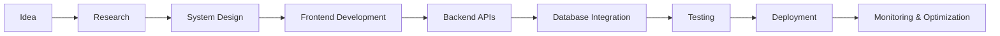

# Hi there, I'm Aditya 👋

<div align="center">

# Full Stack Developer • CSE Student • AI & Civic-Tech Builder


</div>

---

# 🚀 About Me

```yaml
Name: Aditya
Role: B.Tech CSE Student
Focus Areas:
  - Full Stack Development
  - System Design
  - AI-Powered Applications
  - Civic-Tech Platforms
  - Backend Engineering
Current Goals:
  - Crack placements
  - Build production-level projects
  - Improve DSA & problem solving
  - Prepare for GATE CSE
```

---

# 🛠 Tech Stack

<div align="center">

## Frontend


## Backend


## Database


## Tools & DevOps


</div>

---

# 📊 GitHub Analytics

<div align="center">


</div>

---

# 🔥 GitHub Streak

<div align="center">


</div>

---

# 📈 Contribution Graph

<div align="center">


</div>

---

# 🐍 Contribution Snake

<div align="center">


</div>

---

# 🧩 Architecture & Engineering Interests

* Distributed Systems
* Scalable Backend Architecture
* Real-Time Systems
* Cloud Computing
* AI Integration
* Public Infrastructure Technology
* System Design
* API Engineering
* Database Optimization

---

# 💻 Problem Solving

## Platforms

* LeetCode
* GeeksforGeeks
* HackerRank
* Codeforces

## Focus Areas

* Arrays & Strings
* Dynamic Programming
* Graph Algorithms
* Trees & Binary Search Trees
* Greedy Algorithms
* Backtracking
* System Design Concepts

---

# 📚 Current Learning Roadmap

```text
✔ Frontend Development
✔ Backend Development
✔ Database Design
✔ Authentication & APIs
⬜ Advanced System Design
⬜ Kubernetes & DevOps
⬜ AWS Cloud
⬜ Microservices Architecture
⬜ Distributed Systems
```

---

# 🌐 Connect With Me

<div align="center">

<a href="https://linkedin.com/in/YOUR_LINKEDIN">
  
</a>

<a href="mailto:YOUR_EMAIL@gmail.com">
  
</a>

<a href="https://github.com/YOUR_USERNAME">
  
</a>

</div>

---

# ⚡ Quote I Follow

> “Build things that solve real problems, not just projects that fill repositories.”

---

# 👀 Profile Views

<div align="center">


</div>

---

# 🧠 Advanced Engineering Dashboard

<div align="center">


</div>

---

# ⚙ Development Workflow



---

# 🏗 System Design Focus

| Domain              | Skills                                    |
| ------------------- | ----------------------------------------- |
| Backend Engineering | REST APIs, Authentication, Rate Limiting  |
| Databases           | SQL Optimization, Indexing, Schema Design |
| Frontend            | Responsive UI, State Management           |
| Cloud               | Docker, CI/CD, Deployment                 |
| Architecture        | Monoliths, Microservices, Scalability     |
| Security            | JWT, Encryption, Secure APIs              |

---

# 📦 Repository Structure

```text
project-root/
│
├── client/
│   ├── components/
│   ├── pages/
│   ├── hooks/
│   └── services/
│
├── server/
│   ├── controllers/
│   ├── routes/
│   ├── middleware/
│   ├── models/
│   └── utils/
│
├── docs/
├── docker/
├── tests/
└── README.md
```

---

# 🧪 Development Principles

* Clean Code Architecture
* Scalable System Design
* Reusable Components
* API-First Development
* Performance Optimization
* Security Best Practices
* Real-World Problem Solving

---

# 📌 2026 Engineering Goals

* Build 4+ production-grade projects
* Strengthen DSA & competitive programming
* Learn advanced backend scaling
* Master system design fundamentals
* Contribute to open source
* Secure strong software engineering opportunities

---

# 🎯 Current Focus Areas

<div align="center">

| Learning        | Building             | Improving            |
| --------------- | -------------------- | -------------------- |
| System Design   | Civic-Tech Platforms | DSA                  |
| Cloud Computing | AI Integrations      | Backend Architecture |
| DevOps          | Full Stack Apps      | Problem Solving      |

</div>

---

# 🌟 Open Source & Learning

* Learning through consistent building
* Exploring scalable application development
* Improving problem-solving skills
* Understanding system design concepts
* Contributing to meaningful software projects

---

# 🎵 Spotify Integration (Optional)

```md
Add your Spotify now-playing widget here later.
```

---

# 🕒 Coding Activity

<!--START_SECTION:waka-->

```text
JavaScript   10 hrs 20 mins
TypeScript    8 hrs 14 mins
Python         5 hrs 11 mins
Java           4 hrs 30 mins
SQL            2 hrs 12 mins
```

<!--END_SECTION:waka-->

---

# 🧩 Visitor & Follower Metrics

<div align="center">


</div>

---

# ⭐ Support

If you like my work, consider giving a ⭐ to repositories and following my development journey.

---

# 💡 Final Note

> Engineering is not only about writing code — it is about building scalable solutions that create meaningful impact.
